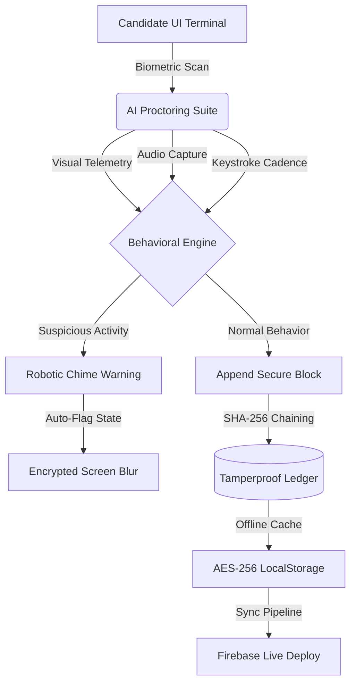

# 🛡️ Nexus Proctor
### *Next-Generation AI Examination & Behavioral Integrity Platform*

[](https://nexus-proctor.web.app)
[](#technical-architecture)
[](#automated-e2e-testing)

Nexus Proctor is a premium, high-tech, **offline-first AI-driven exam proctoring suite** that guarantees exam integrity through real-time multi-modal telemetry analysis, robotic keystroke cadence profiling, and a cryptographic blockchain-style event ledger.

The application is deployed live at **[https://nexus-proctor.web.app](https://nexus-proctor.web.app)**.

---

## 🚀 Key Innovation Pillars



### 1. Multi-Modal AI Telemetry Engine
- **Visual Gaze Tracking**: Monitor coordinate gaze shifts centrally. Detects directional gaze deviations (Left/Right) and triggers secure focus-blurs if boundaries are violated.
- **Object Detection**: High-fidelity device classifier that spots external viewports (like mobile smartphones) inside the exam focal zone.
- **Acoustic Surveillance**: Microphone amplitude scanning combined with ambient frequency filters to alert on whisper patterns.
- **Active Focus Shield**: Instantly encrypts and blurs exam contents the moment browser tab switching, window blurring, or Developer Tools triggers (F12 / Ctrl+Shift+I) are detected.

### 2. Keystroke Dynamics Profiler
- Real-time keystroke dwell time and flight interval analysis.
- **Robotic Cadence Detection**: Uses standard deviation ($\sigma < 4ms$) and typing speed thresholds to distinguish uniform robotic script/macro injections from organic human typing patterns.

### 3. Cryptographic Tamperproof Ledger
- Every proctoring anomaly, transaction, and action is appended to a **blockchain-style ledger**.
- Each log contains its index, timestamp, event type, encrypted payload (simulated AES-256), and parent hash link.
- Audits can recalculate SHA-256 blocks recursively in real-time to pinpoint the exact index of any local storage database tampering.

---

## 🛠️ Technical Architecture & Stack

- **Core Frontend**: Immersive HTML5, Vanilla JavaScript, and Premium Glassmorphism styling utilizing Outfit and JetBrains Mono typography.
- **Real-Time Synthesizer**: Web Audio API digital waveform synthesizer that generates futuristic warning alarms without requiring heavy external asset files.
- **Database & State**: Dual-mode engine:
  - **Online**: Live Firebase Cloud Web App instance.
  - **Offline (AES-256 Simulated)**: Buffered queue utilizing XOR ciphering to cache student submissions locally until network state matches "SECURE SYNC ONLINE".
- **Backend & Hosting**: Google Firebase Hosting infrastructure.

---

## 📦 File Structure

```bash
nexus-proctor/
├── index.html            # Main Portal Workspace (Restored UI + Firebase Compat SDKs)
├── styles.css            # Custom CSS Variable System (Vibrant dark accents & glassmorphic layouts)
├── app.js                # Core App View Routing, Wallet & Dashboard Controls
├── db.js                 # Blockchain Cryptographic Ledger, Cipher Engine & Offline Queue
├── proctor.js            # Telemetry Canvas Scanner, Audio Analyzer & Gaze Simulator
├── firebase-config.js    # Firebase Web App Config Credentials
├── firebase.json         # Firebase Hosting Config (Ignoring heavy subdirectories)
├── .firebaserc           # Firebase target routing configurations
└── test-signup.js        # Playwright E2E signup test script
```

---

## 🚦 Role-Based Operational Portals

Nexus Proctor partitions workflows into three specialized security nodes depending on the credential email used to execute the biometric sign-in:

### 👨‍🎓 1. Candidate Terminal (Student)
- **Biometric Scan**: Executes high-tech facial reticle scan animations to match confidence above 98% before loading.
- **Assigned Exam Matrices**: View assigned readiness exams, durations, policies, and initiate exam sessions.
- **Exam Environment**: Dual-layout split screen containing active exam text (with multiple-choice, essay, or live compile-and-test JS code playpens) alongside the **AI Telemetry Canvas Feed** displaying gaze lines and real-time scanning matrices.

### 👩‍🏫 2. Proctor Control Command (Professor)
- **Live Monitoring Grid**: Live visual stream canvases checking candidate states.
- **AI-Compute Assistant**: Generate custom exam questions dynamically using proctor credits (500 CR).
- **Blockchain Auditing Node**: Conduct a blockchain integrity check to confirm ledger validation, or **Inject a Simulated Tamper** to intentionally corrupt local records and test audit alarms.

### 🕵️‍♂️ 3. Cyber Integrity Audit Workspace (Admin)
- **Explainable AI (XAI) Risk Reports**: Natural language summaries mapping behavioral deviation factors, risk percentages, and severity counts.
- **Keystroke Velocity Cadence check**: Heatmap graphs plotting dwell timings and standard deviation scores to verify humanity metrics.

---

## 🔒 Firebase Hosting Deployment

The project is connected to the Firebase MCP and is fully configured for continuous hosting.

### Deploy Config (`firebase.json`)
We exclude the Next.js playground (`web-app`) to keep deployment packages extremely lightweight:
```json
{
  "hosting": {
    "public": ".",
    "ignore": [
      "firebase.json",
      "**/.*",
      "**/node_modules/**",
      "web-app/**"
    ]
  }
}
```

### Manual Deploy Command
To redeploy updates:
```bash
npx firebase deploy --only hosting
```

---

## 🤖 Automated E2E Testing

The project includes an automated end-to-end (E2E) integration test script written in **Playwright** that tests the registration and login sequence:

### Playwright Registration Parameters:
- **Full Name**: `John Doe`
- **Identity Email**: `johndoe@institution.edu` (Matches Student dashboard route)
- **Access Passcode**: `password123`

### Run E2E Test Suite:
1. Ensure dependencies are installed:
   ```bash
   npm install playwright
   ```
2. Start your local dev web server (e.g. at `http://127.0.0.1:8080`).
3. Run the signup test:
   ```bash
   node test-signup.js
   ```
